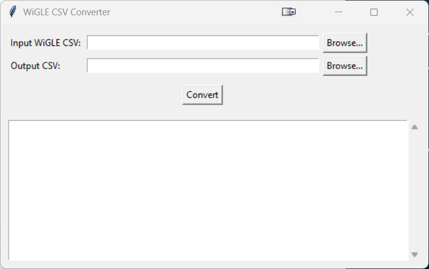

# WiGLE CSV to Excel Template Converter

Standalone Windows program that converts a WiGLE CSV export into a CSV file ready to paste into my Wigle Analysis Excel template. It adds **vendor names** by looking up MAC addresses (OUI) against the [hdm/mac-tracker](https://github.com/hdm/mac-tracker/tree/main/data) IEEE OUI database.

# File Download

https://www.red5labs.com/project.php?slug=wiglecsvconverter

## Requirements

- **Windows** (tested on Windows 10/11)
- **Python 3.8+** (uses only the standard library; no `pip` packages required)
- Internet connection on first run (to download the OUI database; then cached locally)

## Running as an executable (desktop)

Download and run WiGLE_CSV_Converter.exe

The first time you run the .exe it will download the OUI vendor database and save `oui_cache.csv` in the same folder as the .exe. After that, it works offline.

## What it does

1. **Reads** a WiGLE CSV export (skips the app metadata line, uses the header row).
2. **Loads** the MAC vendor (OUI) database:
   - On first run: downloads `oui.csv` from [mac-tracker data/ieee](https://github.com/hdm/mac-tracker/tree/main/data/ieee) and saves it as `oui_cache.csv`.
   - On later runs: uses `oui_cache.csv` so no network is needed.
3. **Looks up** the first 6 hex digits (OUI) of each MAC address and fills in the **Vendor** column.
4. **Outputs** a CSV with columns matching the Excel template:
   - MAC, **Vendor**, SSID, AuthMode, FirstSeen, Channel, Frequency, RSSI, CurrentLatitude, CurrentLongitude, AltitudeMeters, Type (Map Link is generated by the template).

Rows that are not standard MACs (e.g. cellular IDs like `310260_5882_23613`) keep an empty Vendor. Rows with a valid MAC get a vendor name when the OUI is in the IEEE list; otherwise Vendor stays empty.

## Output format

The output CSV has the same column order as **Wigle_Analysis_Vendors.xltx** so you can:

1. Open the template in Excel.
2. Copy the contents of the converted CSV (including header).
3. Paste into the sheet (e.g. starting at cell A2 if row 1 is the template header).

The Excel template builds **Map Link** from latitude/longitude; the converter does not output that column.

## Files

| File | Description |
|------|-------------|
| `Wigle_Analysis_Vendors.xltx` | Excel template for pasting results |
| `oui_cache.csv` | Cached OUI database (created on first run) |

## License

Use and modify as needed. OUI data is from the [hdm/mac-tracker](https://github.com/hdm/mac-tracker) project.
